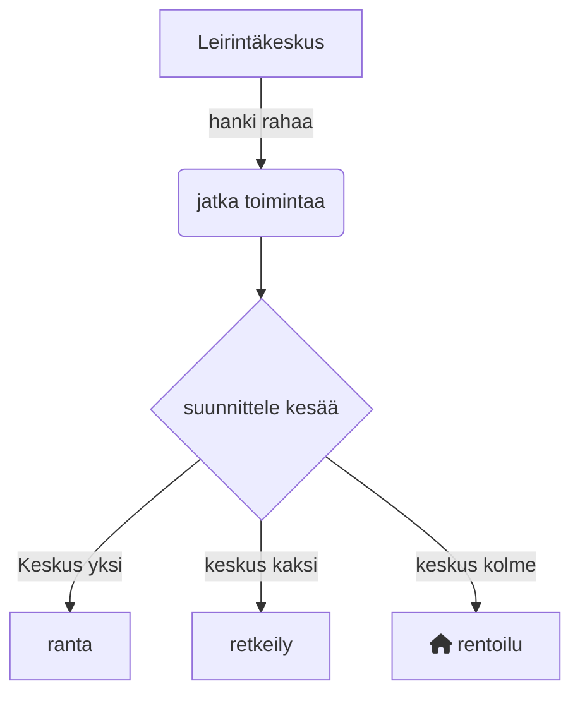

# Taipaleen leirintä keskus                                                      
Taipaleen leirintäkeskus on suosittu leirintäalue, joka tarjoaa ajankohtaista tietoa alueen palveluista ja tapahtumista. Käyttäjät voivat jakaa kokemuksiaan, kirjoittaa arvioita ja osallistua keskusteluihin. Alusta on suunniteltu leirintämatkailijoille, perheille ja luonnon ystäville, jotka haluavat pysyä ajan tasalla ja jakaa vinkkejä.
## Vision Diagram

Tämä kaavio esittää tavoitteemme tulevaisuudelle:

## Roadmap

- Q4 2024: example 1
- Q1 2025: example 2
- Q2 2025: example 3
## Authors

- [@N1louuu](https://www.github.com/N1louuu) (Master)
- [@REDKING-11](https://www.github.com/redking-11) (Coder)
- [@dmitrii6660](https://github.com/dmitrii6660) (Graphical Designer)
## Features

- **kartta**: kyllä voit nähdä kaikki alueemme google mapsista
## FAQ

#### Voinko esittää kysymyksiä?
Kyllä, voit vapaasti ottaa meihin yhteyttä sähköpostitse tai yhteisöfoorumeillamme.

#### Miksi täällä ei ole kysymyksiä?
Tämä UKK (usein kysytyt kysymykset) on uusi, mutta aiomme laajentaa sitä, kun saamme lisää palautetta ja kysymyksiä.
## Feedback
jos sinulla on mitään ideoita tai palautetta ota yhteyttä example@gmail.com kiitos
## Acknowledgements
Laajennamme syvimmät kiitoksemme kaikille, jotka ovat tukeneet Taipaleen leirintäkeskus -projektia. Ideanne, ehdotuksenne ja kovaa työtä ovat tehneet tästä alustasta todellisuuden, ja panoksenne ovat auttaneet muovaamaan Taipaleen leirintäkeskusta sellaiseksi kuin se on tänään.

Erityiset kiitokset:

- Yhteisöllemme jatkuvasta tuesta ja palautteesta.
- Kehitystiimillemme heidän väsymättömästä työstään.
- Kaikille kontribuuttoreille, jotka ovat jakaneet aikaansa ja asiantuntemustaan.
