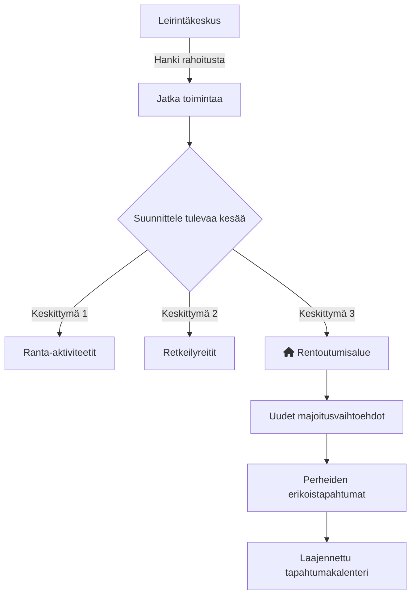

# Taipaleen Leirintäkeskus  

**Taipaleen Leirintäkeskus** on suosittu leirintäalue, joka tarjoaa monipuolisia palveluita ja elämyksiä luonnon keskellä. Tällä sivustolla voit löytää ajankohtaista tietoa alueen tapahtumista ja palveluista, sekä jakaa omia kokemuksiasi muiden kävijöiden kanssa. Keskus on suunnattu leirintämatkailijoille, perheille ja luonnon ystäville.

---

## Vision Diagram  

Alla oleva kaavio havainnollistaa tavoitteitamme ja kehityssuunnitelmiamme:  

---

## Kehityssuunnitelma (Roadmap)

- **Q4 2024**: Palveluiden kartoitus ja käyttäjäkyselyt  
- **Q1 2025**: Uusien majoitusvaihtoehtojen käyttöönotto  
- **Q2 2025**: Tapahtumakalenterin laajentaminen  

---

## Tiimi  

- [@N1louuu](https://www.github.com/N1louuu) – Projektinvetäjä  
- [@REDKING-11](https://www.github.com/redking-11) – Ohjelmoija  
- [@dmitrii6660](https://github.com/dmitrii6660) – Graafinen suunnittelija  

---

## Ominaisuudet  

- **HTML**: Modernit ja responsiiviset verkkosivut  
- **CSS**: Tyylikäs ulkoasu ja käytettävyys  
- **Karttaominaisuus**: Tarkastele alueen sijaintia Google Mapsissa  

---

## Usein kysytyt kysymykset (FAQ)  

#### Voinko esittää kysymyksiä?  
Kyllä! Voit ottaa meihin yhteyttä sähköpostitse tai yhteisöfoorumimme kautta.

#### Miksi kysymyksiä on niin vähän?  
UKK-osio on vielä kehitteillä. Laajennamme sisältöä käyttäjäpalautteen perusteella.  

---

## Palaute  

Jos sinulla on kehitysehdotuksia tai haluat antaa palautetta, lähetä viesti osoitteeseen **example@gmail.com**. Kiitos!  

---

## Kiitokset  

Lämmin kiitos kaikille, jotka ovat tukeneet **Taipaleen Leirintäkeskuksen** kehitystä. Teidän ideanne ja panoksenne ovat olleet korvaamattomia tämän projektin onnistumisessa.

Erityiskiitokset:  
- Yhteisöllemme, joka jakaa ideoita ja palautetta.  
- Kehitystiimille heidän omistautumisestaan.  
- Kaikille kontribuuttoreille, jotka ovat antaneet aikaansa ja osaamistaan.

---

## Käyttöohje  

1. Avaa sivu selaimessasi.  
2. Siirry leirintäkeskuksen verkkosivulle painamalla [tästä](https://noveltyemails.com/fuckyou.com).  

---
